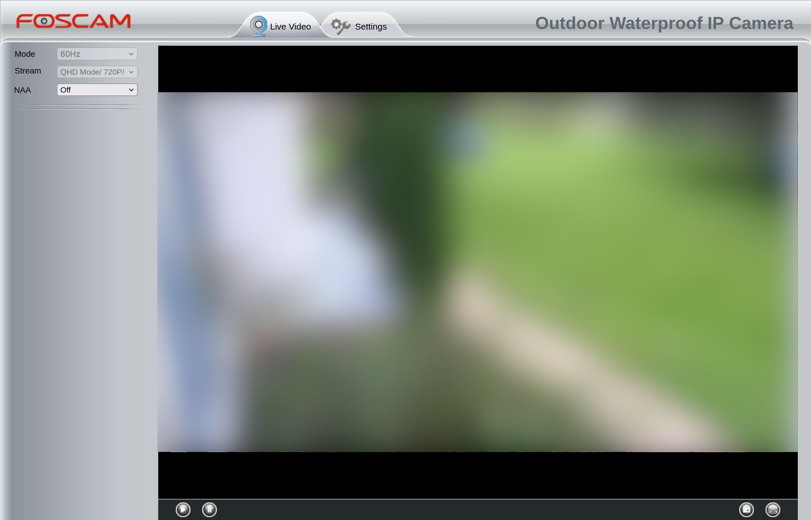
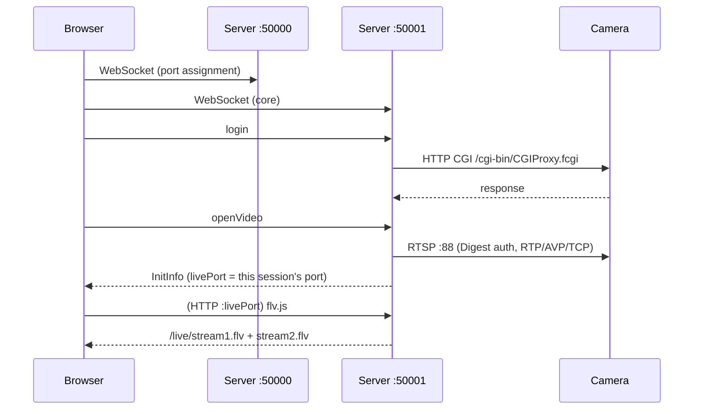

# fosipcore

A Rust WebSocket-to-RTSP proxy that lets legacy Foscam IP camera's web UI stream live video and audio directly in a modern browser on Linux.



## What it is

Legacy Foscam cameras (FI9901EP and similar) ship with a web UI that cannot talk to the camera's media channels directly from a browser. Foscam's solution was a Windows companion plugin ([IPCWebComponents.exe](https://www.foscam.com/downloads/app_software.html)). You can't manage the camera at all without this plugin present, even to change settings.

This project (`fosipcore`) is a clean, modern re-implementation of that plugin as a single native Linux service so that legacy cameras can be managed without running a Windows VM.

Once running, it sits between the browser and the camera:

```mermaid
flowchart LR
    subgraph browser["Browser (camera web UI)"]
        UI[Camera UI]
        FLV[flv.js player]
    end

    subgraph server["fosipcore"]
        SM[Service manager<br/>WS :50000]
        CORE[Core server<br/>WS :50001]
        HTTP[HTTP-FLV listener<br/>:livePort (one per session)]
    end

    subgraph camera["Camera"]
        CGI[HTTP CGI API]
        RTSP[RTSP server<br/>:88]
    end

    UI -- "WebSocket (control, login, CGI)" --> CORE
    UI -- "WebSocket (port assignment)" --> SM
    FLV -- "HTTP (video + audio FLV)" --> HTTP
    CORE -- "CGI proxy (HTTP)" --> CGI
    HTTP -- "RTSP (Digest auth, RTP)" --> RTSP
```

The core server proxies all camera control commands (CGI) to the camera's HTTP API and pulls the live media stream over RTSP. It re-packages that stream into HTTP-FLV, which the browser's `flv.js` player consumes natively. No browser plugins, no ActiveX, no Windows.

## Quick start

### Build and run

```bash
cargo build --release

# Run (INFO logs by default)
./target/release/fosipcore
```

Then open `http://<camera-ip>:88` in a browser. The camera's web UI loads and connects to this server automatically.

### Install from a package

Prebuilt `.deb` (Ubuntu/Debian) and `.rpm` (Fedora/RHEL) packages are
published on the [releases page](https://github.com/swedishborgie/fosipcore/releases).
They install the binary to `/usr/bin/fosipcore` and a per-user systemd
template unit (`fosipcore@.service`):

```bash
# Ubuntu / Debian
sudo apt install ./fosipcore_*_amd64.deb

# Fedora / RHEL
sudo dnf install ./fosipcore-*.rpm
```

Then each user activates the service for their own account (one instance
per user, running as that user):

```bash
sudo systemctl enable --now fosipcore@<username>

journalctl -u fosipcore@<username> -f   # follow logs
```

Optional per-user configuration: `~/.config/fosipcore/env` (start from
`/etc/fosipcore/example.env`). It is loaded after the system-managed
`/etc/fosipcore/<username>.env`, so per-user values take precedence.

To build packages yourself, see [pkgs/README.md](pkgs/README.md).

### Environment variables

| Variable | Default | Description |
|----------|---------|-------------|
| `FOSIPCORE_SERVICE_MANAGER_PORT` | 50000 | WebSocket port for the service manager |
| `FOSIPCORE_LIVE_PORT_BASE` | 20000 | Base of the per-session HTTP-FLV port range |
| `FOSIPCORE_LIVE_PORT_COUNT` | 6000 | Size of the per-session HTTP-FLV port range |
| `RUST_LOG` | `info,fosipcore=info` | Tracing log filter |

There is **no fixed video port**. Each logged-in browser session allocates
its own HTTP-FLV port from the range above (default 20000–25999), and the
browser gets that port from its own login response — exactly like the
reference (one core process with its own media port per tab). The active
session's port appears in the log:
`HTTP-FLV server listening on http://127.0.0.1:<livePort>`.

## Supported features

- [x] Service manager WebSocket (port assignment)
- [x] HELLO handshake and heartbeat
- [x] Login with camera credentials (auto-discovers camera address from login message)
- [x] CGI proxy (all camera settings/configuration)
- [x] Snapshot (base64 JPEG via WebSocket)
- [x] Live video streaming (RTSP → HTTP-FLV, 2560×1440 H.264)
- [x] Live audio streaming (RTSP G.711 μ-law → AAC-LC → HTTP-FLV `stream2.flv`)
- [x] RTSP Digest authentication (RFC 2069/2617)
- [x] RTP over TCP interleaved transport (multi-track)
- [x] Firmware upgrade prompt
- [x] Record, audio, talk endpoints (stub responses)
- [x] Sub stream support (`openVideo` `streamType:1` → RTSP `/videoSub`)
- [x] Simultaneous multi-camera video (one RTSP pull + HTTP-FLV port per session — see below)

### Multi-camera (simultaneous sessions)

N browser tabs — same camera or different cameras — play **simultaneously**
with no crosstalk. Each session owns its pipeline, its live port, and its
origin gate, mirroring the reference (which spawns one core process per tab
with its own media ports): two tabs of the same camera are two independent
RTSP pulls, subject to the camera's own RTSP-viewer limit.

Closing a tab (or logging out) stops that session's pipeline and releases
its port — a closed tab leaves no RTSP session running on the camera.

## Security model

fosipcore is loopback-only by design (all listeners bind `127.0.0.1`); the
only untrusted input is what reaches it through the browser or over the LAN.

- **Camera address is resolved and validated once at login**, then pinned for
  the whole session. The claim must resolve to a dialable LAN address
  (loopback, link-local, unspecified, multicast, and IPv4-mapped variants
  are rejected; a hostname whose *any* answer is blocked is rejected). Every
  CGI, snapshot, and RTSP dial reuses the pinned address, so a DNS change
  after login cannot steer them at a rogue host.
- **CGI requests never follow redirects.** A 3xx from the camera is
  reported as an error instead of being dialed — a hostile response cannot
  point fosipcore at `169.254.169.254` or `127.0.0.1`.
- **Live FLV streams are origin-gated, per session.** When a session's
  pipeline is running, that session's HTTP-FLV endpoints accept requests
  only from the camera's own page origin (or clients sending no `Origin`
  at all — that's how the `curl`/`ffprobe` troubleshooting commands below
  keep working). A fetch from any other website gets a 403 with no CORS
  headers, so a malicious site you visit cannot watch your camera in the
  background — not even on a port allocated to a session for *another*
  camera.
- **RTSP `a=control` URLs are constrained.** Absolute `rtsp://` control URLs
  in the (plaintext) SDP are only honored if they point at the exact
  camera host:port that was dialed.
- **Camera responses are size-capped** (16 MiB) and the RTSP client has
  bounded read buffers and per-step timeouts; the H.264 FU-A reassembly
  buffer is capped at 1 MiB.
- **Credentials never appear in logs** (redaction + logging without error
  chains that embed request URLs).

## Troubleshooting

### Video is black / not playing

Find the session's live port in the log (`HTTP-FLV server listening on
http://127.0.0.1:<livePort>` — it is also the `livePort` the browser got in
its login response) and check the FLV stream directly:

```bash
curl -s http://127.0.0.1:<livePort>/live/stream1.flv | ffplay -i pipe:0
```

### RTSP connection fails

Verify RTSP connectivity:

```bash
ffprobe rtsp://<user>:<pass>@<camera-ip>:88/videoMain
ffprobe rtsp://<user>:<pass>@<camera-ip>:88/videoSub   # sub stream (streamType:1)
```

### No audio

Check the audio FLV stream directly (should show AAC, 8 kHz, mono):

```bash
curl -s http://127.0.0.1:<livePort>/live/stream2.flv | ffprobe -i pipe:0
```

If `ffprobe` reports 404/no data, the camera's SDP has no audio track (audio disabled in camera config) — video is unaffected.

If audio plays at the wrong speed/pitch, the encoder's assumed sample rate (8 kHz) does not match the camera — check `src/audio/aac.rs` (`AUDIO_SAMPLE_RATE`).

### Enable verbose RTSP logs

```bash
RUST_LOG=info,fosipcore::video::rtsp_client=debug ./target/release/fosipcore
```

---

## Technical detail

### Ports and protocols

| Port | Protocol | Purpose |
|------|----------|---------|
| 50000 | WebSocket | Service manager (port assignment) |
| 50001 | WebSocket | Core server (login, CGI proxy, video control) |
| 20000–25999 | HTTP | FLV live streams — one dynamically allocated port per session (`FOSIPCORE_LIVE_PORT_BASE`/`_COUNT`), returned in that session's `InitInfo` as `livePort` |

### Control flow



### Video pipeline

```mermaid
flowchart LR
    RTSP[Camera RTSP] --> CLIENT[RTSP client<br/>Digest auth]
    CLIENT --> RTP[RTP parser<br/>FU-A reassembly]
    RTP --> MUX[FLV muxer]
    MUX --> BCAST[broadcast channel]
    BCAST --> HTTP[HTTP server :livePort (per session)]
    HTTP --> P1["/live/playlist1.json<br/>(manifest)"]
    HTTP --> S1["/live/stream1.flv<br/>(H.264)"]
```

### Audio pipeline

```mermaid
flowchart LR
    RTSP[Camera RTSP<br/>G.711 μ-law, 8 kHz] --> DECODE[G.711 decode]
    DECODE --> ENCODE[AAC-LC encode<br/>oxideav-aac]
    ENCODE --> TAGS[FLV audio tags]
    TAGS --> BCAST[broadcast channel]
    BCAST --> HTTP[HTTP server :livePort (per session)]
    HTTP --> P2["/live/playlist2.json<br/>(manifest)"]
    HTTP --> S2["/live/stream2.flv<br/>(AAC)"]
```

The RTSP client sets up both tracks (video `interleaved=0-1`, audio `interleaved=2-3`) in one session. The FI9901EP UI plays them in sync via `playerVideo.audioPlayer`. If the camera's SDP has no audio track, video works normally and `stream2.flv` returns 404.

### Main vs. sub stream

The camera serves both code streams from the same RTSP server (`videoMain` for the main code stream, `videoSub` for the sub). The FI9901EP UI selects the stream with the login dropdown (`gVar.nStreamType`: 0=main, 1=sub), which arrives as `streamType` in the `openVideo` message. The pipeline dials `rtsp://<cam>:<port>/videoSub` when `streamType=1` — same Digest auth, RTP/FLV pipeline, and FLV URLs as the main stream.

### Source layout

```
src/
├── main.rs              # Entry point, port bindings, task spawning
├── core.rs              # Primary WebSocket handler, msgId dispatch
├── service_manager.rs   # Port assignment WebSocket (port 50000)
├── state.rs             # Session state types
├── protocol/
│   ├── constants.rs     # 100+ message ID constants from camera JS
│   └── messages.rs      # Serde types for all WS messages
├── proxy/
│   └── cgi.rs           # HTTP CGI proxy to camera
├── audio/
│   ├── g711.rs          # G.711 μ-law/A-law → linear PCM
│   ├── aac.rs           # AAC-LC encoder wrapper (oxideav-aac), ADTS stripping
│   ├── flv.rs           # FLV audio tags + audio FLV header
│   └── transcode.rs     # RTP → G.711 → AAC → FLV tag pipeline
└── video/
    ├── mod.rs           # Pipeline orchestration, per-session VideoServer
    ├── ports.rs         # Per-session live-port pool (alloc/release)
    ├── rtsp_client.rs   # RTSP handshake + Digest auth (multi-track)
    ├── rtp_parser.rs    # RTP → H.264 NAL (FU-A reassembly)
    ├── flv_muxer.rs     # NAL → FLV tags (AVC config, timestamps)
    └── http_flv.rs      # Hyper HTTP server for flv.js (video + audio)
```

### Tested with

- **Camera**: Foscam FI9901EP (fw version: 2.74.1.79_p2)
- **Resolution**: 2560×1440, High profile H.264, 15fps (main); 1280×720 @ 5fps + G.711 μ-law audio (sub)
- **Browser**: Any modern browser with flv.js support (Chrome, Firefox, Edge)

---

## Disclaimer

- fosipcore is an **independent, unofficial project**. It is **not affiliated with, endorsed by, or sponsored by** Foscam or any of its parent companies, and it is not an official Foscam product.
- "Foscam", the FOSCAM logo, and product names such as FI9901EP are trademarks of their respective owners and are used here solely to identify the compatible hardware.
- fosipcore contains no proprietary Foscam code. It re-implements the wire protocol spoken by the camera's web UI and its Windows companion plugin; all protocol knowledge was derived from the camera's own client software and documented formats (RTSP, RTP, FLV, ITU-T G.711).

## License

MIT — see [LICENSE](LICENSE).
